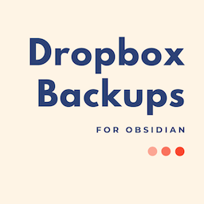

## Obsidian Dropbox Backups

Automated backups to Dropbox of your entire vault every 20 minutes.



Backups are stored here:

```
/Apps/Obsidian Backups/
```

Underneath that folder, backups get stored as:

```
/VAULT_NAME/YEAR/MONTH/DAY/TIME_WITH_FRACTIONAL_SECONDS/VAULT_CONTENTS
```

We use fractional seconds to prevent collisions with ad hoc backups.

### Usage

Click the icon to authenticate with Dropbox. After that, backups will happen every 20 minutes. You can also fire off a backup at any time by clicking the ribbon icon.

The slashed cloud indicates that you need to authenticate with Dropbox:


The large arrow indicates the the upload has started:


The small arrow inside the cloud indicates the upload is about 50% done:


The cloud with a check mark indicates that the backup is complete!


Demo:


### Settings

A setting is available to 'Exclude binary files', this will skip any file without one of the following extensions:

-   md
-   org
-   txt

### Dropbox permissions

This app requires the following Dropbox permissions:


-   `account_info.read`: You can't turn this one off, I don't think I actually need it. You can see in the source code that I don't read anything from it.
-   `files.metadata.read`: You can't turn this one off either. I never read or list files, so it shouldn't be necessary, but Dropbox doesn't allow turning it off.
-   `files.content.write`: This is the one I actually need. This app only writes files. This app cannot read files. It is also scoped to only its folder.

### Known limitations

Any files not in this list:

-   `md`
-   `org`
-   `txt`

Are _assumed_ to be binary files, and read/uploaded as such. Please let me know if more files need to be added to this list that are actually plain text.

### Manually installing the plugin

-   Copy over `main.js`, `manifest.json` to your vault `VaultFolder/.obsidian/plugins/obsidian-dropbox-backups/`.
